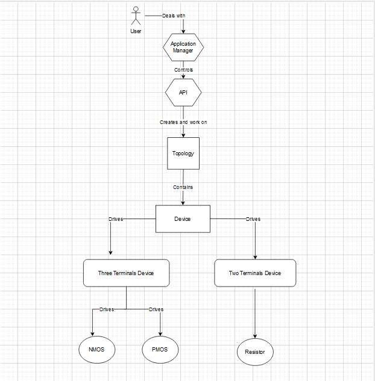

<div align="center">
 
# Topology API

# 📙 About
An API library which provides the functionality to access, manage and store device topologies.

# 📝 Description
1. Read a topology from a given JSON file and store it in the memory.
2. Write certain topology from the memory to a JSON file.
3. Query about which topologies are currently in the memory.
4. Delete a given topology from memory.
5. Query about which devices are in a given topology.
6. Query about which devices are connected to a given netlist node in
a given topology.


# Class Structure



# 🏁 Getting Started

## Classes
### Main

* This class creates an object from the Application Manager class which is used to call the API and apply all functionalities
* It contains the main loop of the program which allows the user to select which operation to perform

### API

This class contains the memory of the API as a map of string which is the topology ID as a key of the map and pointer to topology as a value.

* This class contains the functions of the API :-
	- bool ReadFromJson(string filePath);
	- bool WriteToJson(string TopID, string outFileName);
	- bool getTopologiesInMemoryQuere();
	- bool DeleteTopology(string TopID);
	- vector<Device *> DevicesInTopology(string TopID);
	- vector<Device *> NodeDevices(string TopID, string NodeID);

* Each functionality is validated completely in case a topology/node not found for example, etc...

### Topology
* This class is used to create topologies and connect devices with each others

* it has a vector which contains the Devices which are stored and connected in each  topology

### Device

*  This Class is used as an abstract class for 2 other classes which are two terminal devices and three terminal devices
* in which I have implemented the common functions for any device

# Two Terminal Device
* This class inherts from the Device class and derives the Resistor class 

### Resistor
 
* The resistor inherits from class Two Terminal device and overrides function printDev() to add resistance as its type

### Three Terminal Device 
* This class inherts from the Device class and derives the NMOS and PMOS

### NMOS 
 
* The NMOS inherits from class Three Terminal device and overrides function printDev() to add NMOS as its type

# PMOS

* The PMOS inherits from class Three Terminal device and overrides function printDev() to add PMOS as its type

### Testing

* This class tests each function of class API


## 💻 Installing

```
git clone https://github.com/abdelazizSalah/APITopology
```

## 📷 Screenshots

#### Read JSON file 


#### Write JSON


#### Query Topologies


#### Delete a topology 


#### Query devices in a topology


#### Query devices with netlist node

 
#### Testing
